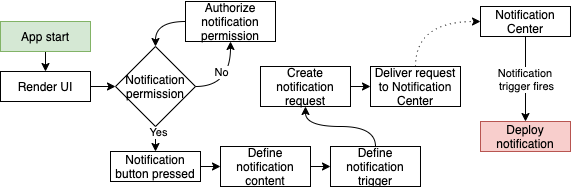
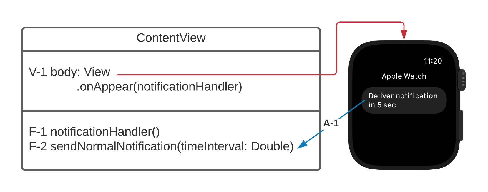

# Notification-App
Simple application for dispatching Notifications from iOS and WatchOS. Implemented with actionable notification on iOS as well.

# Flow

The notifications app's flow is quite simple, as it mainly demonstrates the flow of any notification. In this example, the app requests authorization from the user when it initially opens instead of when the notification is scheduled.

# Class diagram

Due to the app's limited functionality, it uses nested functions because a proper class hierarchy is not needed for structuring.
 

  - [V-1] View body of the app. This is where the interface is implemented. The onAppear action calls the F-1 function upon the appearance of the view. Here used as a simple way of initializing the application.
  - [F-1] Notification handler function is responsible for requiring the users' permission on startup to receive notifications from the app. 
  - [F-2] Notification dispatching function that takes a timeInterval: Double as a parameter. timeInterval parameter added for flexibility in testing.
  - [A-1] Button action. The Blue arrow indicates the F-2 function being called when the button is triggered. As indicated in the text, the action calls the function with timeInterval: 5.0 to have the notification delivered 5 seconds later.
